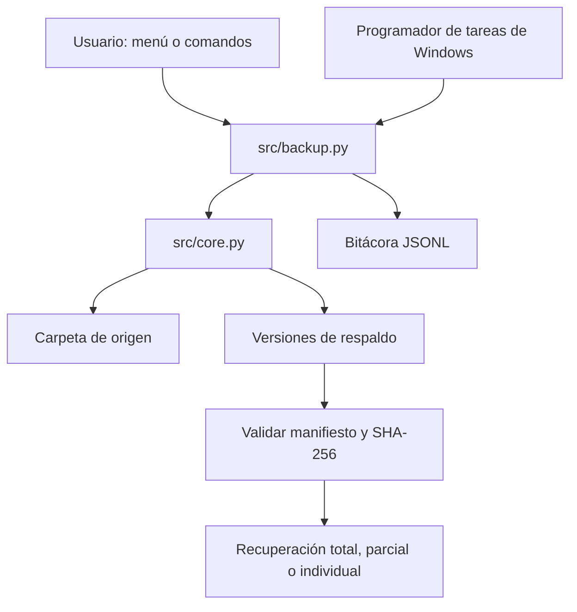

# Diseño y alcance

## Interpretación

Hay dos entregables: demostrar respaldo/recuperación con un sistema existente y desarrollar uno propio que permita recuperar. La automatización usa comandos no interactivos y el Programador de tareas. Las variantes total, parcial e individual corresponden al alcance de recuperación, no a respaldos diferenciales.

## Arquitectura



La práctica nativa ejecuta `robocopy.exe` por separado. El motor Python implementa su propia copia y validación.

## Formato

```text
backups/
└── Backup_2026-09-07_200000_123456_ab12cd34/
    ├── manifest.json
    └── datos/
        ├── documentos/
        │   └── tarea.txt
        └── fotos/
```

El manifiesto contiene versión del formato, identificador, fecha UTC, origen, cantidad de archivos, bytes y entradas con ruta relativa/tipo. Los archivos registran tamaño, fecha de modificación en nanosegundos y SHA-256. Las carpetas se registran aunque estén vacías. El nombre usa hora local, microsegundos y un sufijo aleatorio; `created_at` conserva la fecha UTC.

## Crear una versión

1. Validar origen y almacén: separados, sin enlaces ni junctions.
2. Inventariar archivos/carpetas y comprobar espacio inicial.
3. Copiar a un temporal `.incomplete-*` del almacén, calcular hashes y comprobar las copias.
4. Comprobar que el inventario del origen no cambió.
5. Escribir el manifiesto y verificar la versión completa.
6. Renombrar el temporal a su nombre definitivo.

Un error normal limpia únicamente el temporal de esa ejecución. Un cierre abrupto puede dejarlo incompleto; no se ofrecerá como versión recuperable. Las comprobaciones de modificación no sustituyen una instantánea VSS ni una exportación de base de datos.

## Recuperar

1. Leer y validar todo el manifiesto, sin confiar en sus rutas.
2. Seleccionar todas las entradas, una carpeta con descendientes o un archivo.
3. Validar los hashes seleccionados; en modo total detectar también archivos extra en el respaldo.
4. Revisar todos los conflictos antes de escribir.
5. Preparar los seleccionados en un temporal junto al destino y verificar de nuevo.
6. Recuperarlos conservando rutas relativas y comprobar el resultado.

Parcial/individual permite rescatar contenido sano si otra parte está dañada, siempre que el manifiesto completo siga siendo válido. Total exige integridad de toda la versión. Los archivos adicionales del destino permanecen intactos. No es una transacción de todo el árbol: una interrupción en la escritura final puede dejar algunos archivos recuperados y otros pendientes.

## Automatizar

La tarea diaria ejecuta el mismo comando `respaldo` usado manualmente. Emplea rutas absolutas, directorio de trabajo fijo, sesión interactiva, privilegios normales y política `IgnoreNew` para que la misma tarea no se solape. La bitácora y el código de salida permiten comprobar el resultado. No requiere dejar abierto el menú.

## Seguridad y límites

| Situación | Comportamiento |
|---|---|
| Archivo bloqueado, permisos insuficientes o disco lleno | Error, sin publicar versión incompleta |
| Respaldo dentro del origen | Rechazado para evitar copias recursivas |
| Ruta `../`, absoluta, unidad Windows o flujo NTFS | Rechazada |
| Enlace simbólico/junction | Rechazado antes de resolver la ruta |
| Archivo existente al recuperar | Error por defecto; reemplazo explícito |
| Manifiesto malformado, entrada duplicada o hash incorrecto | Error legible |
| Bitácora sobre datos protegidos o enlace físico | Rechazada |
| Modificación conjunta de manifiesto y datos | Fuera de alcance: no hay firma/autenticación |
| Cambios concurrentes maliciosos de rutas | Fuera de alcance: usar carpetas controladas |
| Avería del disco que contiene origen y respaldo | Requiere copias en otro dispositivo |

Se restaura contenido y se conservan metadatos básicos de archivos cuando el sistema los admite. No se promete conservar permisos/propietarios, todos los metadatos de directorios, enlaces, flujos alternativos ni aplicaciones instaladas. No utiliza credenciales ni envía los datos a servicios externos.
